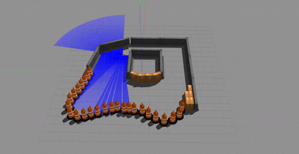

# Deep-RL-Self-Driving-Robot Documentation

UCF HEC404 Lab: A deep reinforcement learning platform for self driving robots

## Deep Reinforcement Learning for Robotics 
In recent years, there has been growing interest in Reinforcement Learning (RL), where a machine learns to interact with an environment with the aim of achieving the maximum reward. Due to recent research that was done on Intel AI Lab’s Coach, implementing RL in robotics systems has gotten simpler and more robust. Nevertheless, this is limited by various factors such as complex environments and time-consuming training. The aim of this project is to give a comprehensive review of Q-Learning in Self Driving Cars.

## Hardware
The robot that is being simulated in this experiment is Traxxas RC rally car (recommended model: Ford Fiesta ST), with the primary goal of driving autonomously 
  
## Architecture 
In order to apply RL to the simulation, the architecture should consist of four main software blocks: Intel AI Lab’s Coach, RoboMaker API, ROS and Gazebo. Coach’s framework enables smoother implementation of OpenAI’s Gym environment for robotics application.

## Simulation of environment:
     

## Q-Learning 
In robotics, Q-Learning offers an algorithm for the design of complex behaviors. The challenge is in creating a simple environment that the Q-Learning model can use to train, evaluate and test. In order to simplify the algorithm that is being used in RoboMaker, Q-function parameters should be examined first .

### Learning Rate
Learning rate (α) dynamically changes with respect to the number of actions (a) that the robot takes. Given that the higher the rate is, the learning occurs quicker, during the initial stages the rate is higher if the robot reaches the target with fewer action (α = 0.7). As the number of actions rises, the learning rate will get decayed (α = 0.01).
### State
In Gazebo environment, the position of the robot can be considered as a state or validation of how close the robot is to the target.
Although after each episode the position of the robot is reset to center, the position of the target robot will change randomly in the y-axis. 
Also, the robot relies on the camera image in order to find the target. The given image from simulator at each frame is saved as a vector (intensity, height, width, 3). By having each state relative to the distance from the target, the robot's understanding of the environment gets shaped. Which is where the robot utilizes the images taken from the camera to detect the target and move towards it.   
### Action
The robot’s actions are defined by step function which includes steering and throttle.
Changes to these two parameters create various movements. For example, Moving left consists of the following values:
throttle = 0.3, steering = - 0.75
This will allow the robot to move in a circular motion rather than rotate to left and move forward. Interestingly, this action will cause some minor problems in the Results section of this paper.   
### Reward
The reward system holds the key to success in Q-Learning. For optimal results, it needs to be aligned with the goal of the robot which in this case is reaching the target faster with each episode. 

If the distance of the robot to its target gets lower than its last distance then the reward function will get activated and the reward will be given by the following:

As seen above, the closer the robot is to target the more reward it will get. It should be kept in mind that the reward system stops for each of the following:

First, the robot’s distance to the target becomes larger than the fixed value. including the crashing. This will help the simulation to train the robot in a way that at all times stay within range of the target. 

Distance to target > 5

Second,  since each action increases the step value, the simulation stops after the number of max steps is reached.
## Results:  
The robot’s knowledge of the last episode comes down into the observation of states. To keep it simple, the robot will take action and receives a reward, this feedback is saved after each episode. Thus, the robot takes as many steps as possible, learning by observing states and actions it took to get the reward. 
## Evaluation
 The more reward the robot will have at end of each session shows that the better the model performs. However, this gives us a very limited understanding of how the system works and in what way tweaking parameter of source code helps the results.
# Future Work: 
Implementing LIDAR based reward system

## Books and Articles:
[(1) Learning ROS for Robotics Programming - Second Edition](https://www.packtpub.com/hardware-and-creative/learning-ros-robotics-programming-second-edition) .   
(2)	Zamora, Iker, et al. "Extending the OpenAI Gym for robotics: a toolkit for reinforcement learning using ROS and Gazebo." arXiv preprint arXiv:1608.05742 (2016).
## Sources:
  For rapid setup of environment the following sources has been used:   
 1. [AWS-Deep Racer](https://github.com/aws-robotics/aws-robomaker-sample-application-deepracer)   
 2. [Univerisity of Virginia](https://github.com/linklab-uva/f1tenth_gtc_tutorial#1-install-robot-operating-system-ros)   
 
